```{r setup, include=FALSE}
options(htmltools.dir.version = FALSE)
# run xaringan::inf_mr() to interactively show slides changing on right
library(emo)
```

# Keep in touch

[`r icon::fa("twitter")` @Vebash](http://twitter.com/vebash)  
[`r icon::fa("github")` @sciencificity](http://github.com/sciencificity)  
[`r icon::fa("paper-plane")` vebashini@gmail.com](mailto:vebashini@gmail.com)

---


<div style = "width: image width px; font-size: 100%; text-align:center;">
Our package will be functional but not necessarily pretty.
</div>


---
class: inverse, center, middle

# Get Started
### "In fact, anyone can and should write R packages!"<sup>1</sup>

.footnote[
[1] Quote from Jeff Leek and Shannon Ellis  
]
---

# What's a package anyway?

Packages are organised units of reproducible R code. 

A _package_ includes:
- __`R functions`__<sup>1</sup>: abstraction of details - user only needs to know what inputs and outputs are needed.
- __`Documentation`__: describing how to use the functions.
- __`Data`__.

It's a _friendly_ way to distribute your code, or even _reuse_ it yourself! 

.footnote[
[1] We expose __`user-facing functions`__, so the user/future you does not need to be concerned with the supporting/helper functions.
]


---
# Ways to install a package<sup>1</sup>

* Packages are mainly stored on [Comprehensive R Archive Network aka CRAN](https://cran.r-project.org/web/packages/available_packages_by_name.html) --> we install these using:
Menu Item `Tools -> Install Packages ...` OR
```{r eval=FALSE, tidy=FALSE}
          install.packages('ggplot2')
```
* There are also many packages on GitHub --> we install these using a helper package `devtools`:
```{r eval=FALSE, tidy=FALSE}
          install.packages('devtools')
          devtools::install_github("sciencificity/werpals")
```
          
Then we load the package to make the functionality available using:
```{r eval=FALSE, tidy=FALSE}
  library(werpals)
```
        
.footnote[
[1] Further to these there's [bioconductor](https://www.bioconductor.org/), but having never worked with it I just mention it here for those interested.
]        
---
# Name that thing
.pull-left[]

.pull-right[
### Formal Naming Requirements
- Must only consist of letters, numbers and periods i.e.  `.`; 
- Must start with a letter; and
- Cannot end with a period. 

You can’t use either hyphens or underscores in the package name. 
]

__Other Tips:__
- It is recommended to avoid using periods in the package name, as it is easily confused with function names in the OO system of R.
- Find a name that is easy to Google.
- Avoid using capitalisation. For e.g. I wanted to name the original pkg `disneycolouR` but Hadley advises otherwise `r emo::ji("smile")`.
- Try and find a name that evokes what the pkg does.
- Add an __`r`__ to the name, if it makes sense e.g. tidyr, dplyr etc.

---
# Whodunnit? Colonel Mustard in the Kitchen with the Trophy?
### Let's start a Rumour


- We can create an R script file and place it in the __`/R`__ folder, or we can use the `usethis` package. 

  ```{r eval=FALSE, tidy=FALSE}
      usethis::use_r("cluerumour")
  ```
- Fill in the body of the function(s)  
---
# Create a package

- Check if the name you're thinking about `r emo::ji("thinking")` is available? 

.pull-left[
```{r eval=FALSE, tidy=FALSE}
install.packages("available")
available::available("cluerumour")
```
]
.pull-right[

]

- Create a new R Project from the menu:

  `File -> New Project -> New Directory -> R Package` [Initialise with a git repo]
  
  
---
class: inverse, center, middle
# What have we got?
---
# Structure of a package
- DESCRIPTION : the metadata of the package (package name, version, author, maintainer, dependencies etc.)
- NAMESPACE : how your package interacts with other packages (what does the package import) and what you make available to the user (what does the package export).
- R/ : code files
- man/ : documentation files
- data/ : data
- .Rbuildignore : describes what will be ignored when the package is built

---
# New "Build" tab in the pane where "History" and "Environment" show
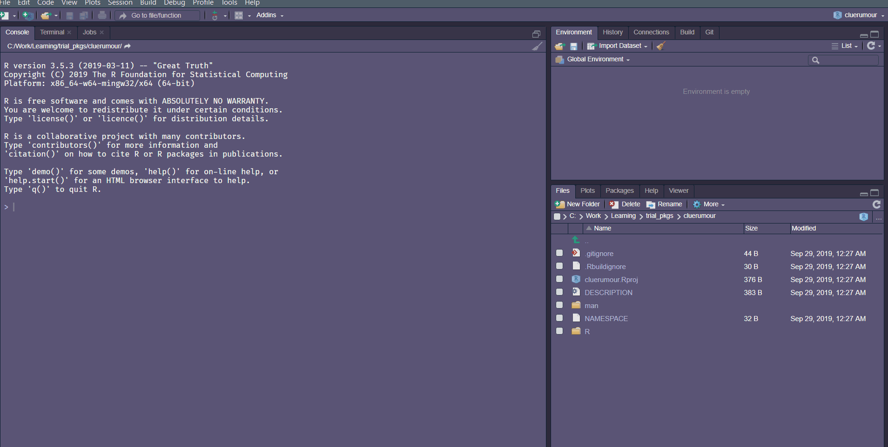
---
# Some cleanup and config

- If you created the pkg without bringing your own code in, a default "R/hello.R" file and "man/hello.Rd" will be created. Delete these files.
- Configure your build tools: `Build Tab -> More -> Configure Build Tools...`.
  * `r emo::ji("check")` Generate documentation with Roxygen and 
  * Click Configure...: `r emo::ji("check")` "Install and Restart" or `r emo::ji("check")` "Build and Reload" whichever is available on your configure.
- Delete the `NAMESPACE` file to regenerate this later.

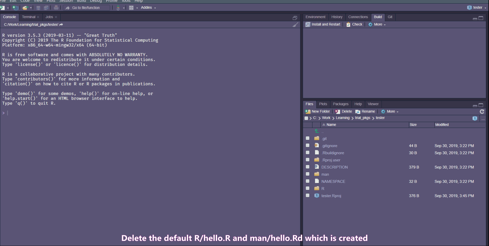
---
# Building and Testing

- Check Package: In Build Pane -> click `r emo::ji("check")` Check OR run

  ```{r eval=FALSE, tidy=FALSE}
  devtools::check()
  ```
- You should see some warnings about a license, and the undocumented functions.
- In our case depending on the file you imported (if you used my test file) you'd get additional warnings about the imports which are not declared.

---
# Update __Description__ File

- The contents of the description file are pretty self explanatory.
- Change `Author:` to `Authors@R:` with value
  ```{r eval=FALSE, tidy=FALSE}
    person("Vebash", "Naidoo", 
           email = "test@thatplace.co.za", role = c("aut", "cre"))
  ```
- The min necessary, is an Author (aut) and Maintainer (cre); the above line makes the `Maintainer:` field redundant so you may remove it.
- Run the ffg. to create a license - it will update the DESCRIPTION file:
  ```{r eval=FALSE, tidy=FALSE}
  usethis::use_mit_license("Vebash Naidoo")
  ```
- Add a `Depends: R (>= 3.3.0)` for a minimal R version your package would need.
---
# Take it for a spin

- Usually you would test your functions but loading it into the workspace or sourcing the file.

- Tbh, I did run my functions this way. I created the functions outside of the package and then loaded the code file I wanted included in my package at the Project creation step.
- Even if you built your scripts outside of the project, you should test it here using the `devtools` package as follows:
  ```{r eval=FALSE, tidy=FALSE}
  devtools::load_all()
  ```
  
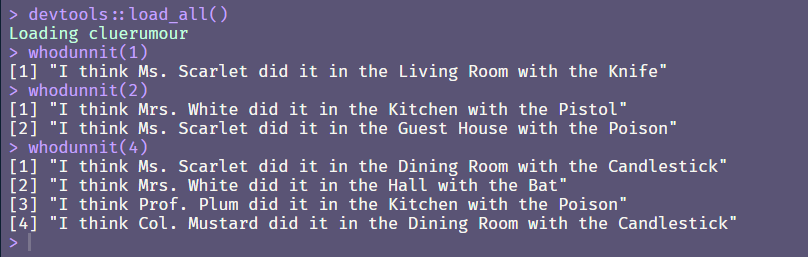  
---
# Git .... outa here
### Setup the Git connection
- Go to `GitHub -> Repositories -> Click the` <span style="color:green">"New"</span> `button` to create a new repo.

- Back in RStudio, in the __Terminal__ run:

  git remote add origin https://github.com/yourname/cluerumour.git
  
- Optional - In the RStudio __Console__ run: 

  `usethis::use_git_config(user.name = "Your Name", user.email = "YourName@thatplace.com")`

- __RStudio Git Tab__: `Click Commit -> choose files to commit -> Add a commit message -> Click Commit`

- Thereafter exit the Commit window, and in your RStudio __terminal__ window type:

  git push -u origin master

- The `Push` and `Pull` buttons should now be available in the Git tab.
---
# Document Functions
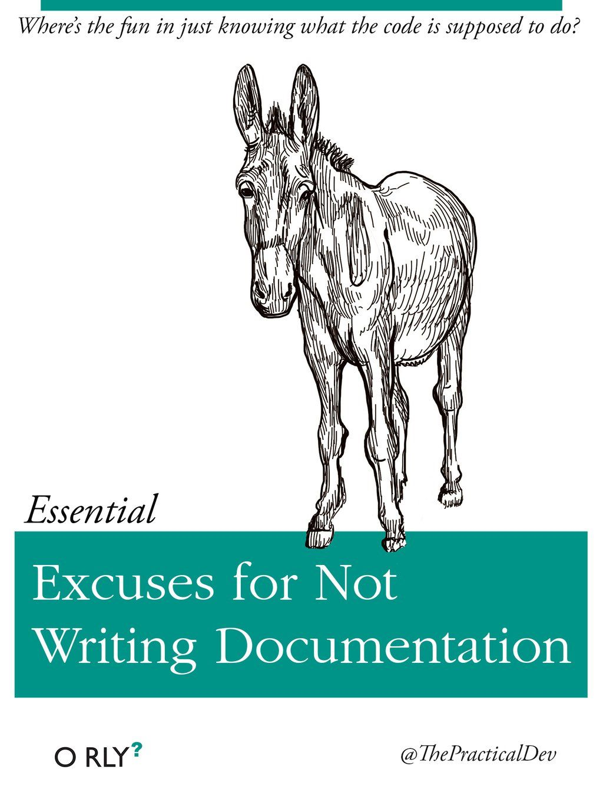  
- Navigate inside your function, then access menu item `Code -> Insert Roxygen Skeleton` to insert a documentation template. 
- Things to consider: 
  * Is this a helper function? Or one that is user-facing? Only `@export` user-facing functions.
  * Does your function use any packages? __DO NOT__ use library(xxx). Instead qualify the function you're using from which package it comes from e.g. `tidyr::pivot_longer()` and include the comment
            `#'@importFrom tidyr pivot_longer`
---
# Roxygen magic

- Okay we have included our imports and exports in the NAMESPACE file created by Roxygen, but the DESCRIPTION file will generate an error - try it ... run `devtools::check()`.
- To add the Imports<sup>1</sup> part into your DESCRIPTION file run:
`usethis::use_package("purrr") # Defaults to imports`

.footnote[
[1] Imports is something your functions use directly, if you want to add a `Suggests` to your package use: `usethis::use_package("purrr", "Suggests")`. Suggested packages are usually not directly used by your functions - it's something you may have used to test your package for example.
]  
---
# Roxygen magic ...

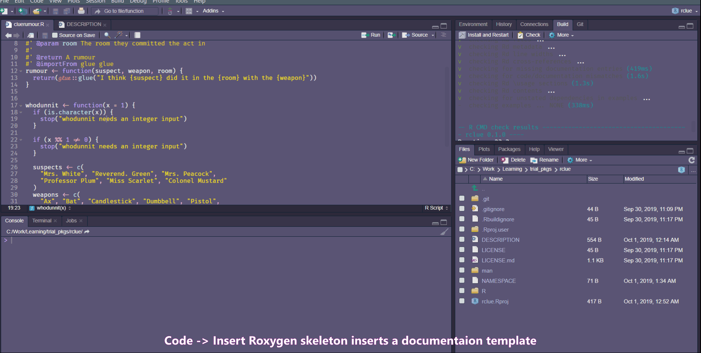
          
---
# Unit tests

- `Build -> More -> Clean and Rebuild`

- In console run: `usethis::use_testthat()` - creates a test folder and necessary files.

- The tests aren't written for you, the setup is created!

- In console run: `usethis::use_test("filename")`

- Fill out your tests and then run the tests using:
    ```{r eval=FALSE, tidy=FALSE}
    devtools::load_all()
    devtools::test()
    ```
---
# Create a Readme file
- A skeleton of a Readme file will be generated if you use: 

    `usethis::use_readme_rmd()`

- Knit the document to create the Readme.

- Commit and Push your files to GitHub


---
class: inverse, center, middle

# The Ultimate Test!

---
# ..... Does it load?

- Go to your folder where your installs download. Delete the package you just created.

- Open a fresh RStudio session.

- Run the install as per your Readme file on GitHub:
      ```{r eval=FALSE, tidy=FALSE}
      devtools::install_github("sciencificity/cluerumour")
      ```
- Test your package and the help pages load etc.      
---
# So why is this not pretty?
So, I did say the package will be functional but not necessarily pretty. Some additional things to do:
1. Run Travis to check your package install on linux, ubuntu etc. `usethis::use_travis()` [Your package has to be public].
2. Run covr to check package coverage.
3. It was a trivial example function and we did not have any data in our package.
3. But all in all ....


---
# Resources

1. [Dev version: R packages book](https://r-pkgs.org/)
1. [Complete original version: R packages book](http://r-pkgs.had.co.nz/)
1. [Pre-flight check list](https://github.com/rdpeng/daprocedures/blob/master/lists/Rpackage_preflight.md)
1. [Writing an R package from scratch](https://hilaryparker.com/2014/04/29/writing-an-r-package-from-scratch/)
1. [R package development videos](https://www.youtube.com/playlist?list=PLk3B5c8iCV-T4LM0mwEyWIunIunLyEjqM)
1. [R package primer](http://kbroman.org/pkg_primer/)
1. [RStudio video on package writing - this is the resource I used originally!](https://resources.rstudio.com/wistia-rstudio-essentials-2/rstudioessentialsprogrammingpart3redux)

---

# Git - Some tips & Useful commands (Windows)

## Using Git Bash or the Terminal window in RStudio
- `pwd`: Tells you where you are currently, literally print working directory.
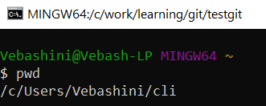

- `ls`: Gives you a list of files and folders in your current working directory.
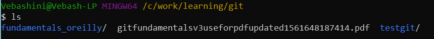

- `mkdir name_of_folder`: Makes a new directory called **name_of_folder** in the current working directory.
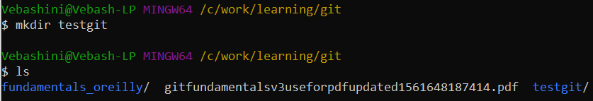

---
# Git - Some tips & Useful commands continued ...
- `cd name_of_folder`: Places you in the **name_of_folder** directory.
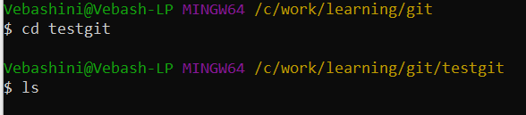

- `git init`: Initialises a git repo in the directory you run the command from. You should now see a .git folder if you run `ls` after the initialisation.
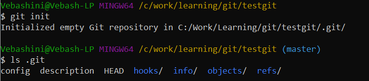

- `git config user.name "Firstname Surname"` AND `git config user.email "test@testexample.com"`: Adds the user name and email address to the config file.
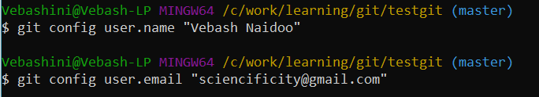

---
# Git - Some tips & Useful commands continued ...
- `cat .git/config`: Displays the contents of the config file.
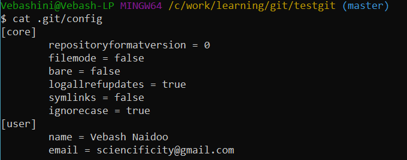

- `git log`: Shows you the history of your repo, starting at the latest commit and working backwards.
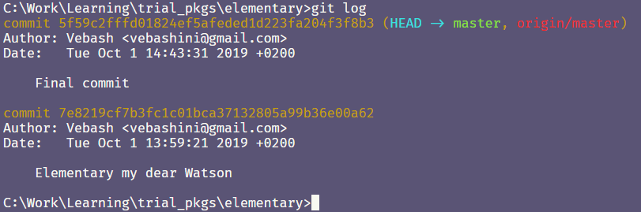

---

class: center, middle

# Thanks!

Slides created via the R package [**xaringan**](https://github.com/yihui/xaringan).

