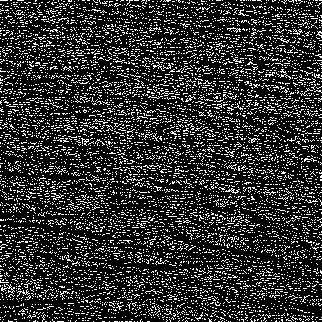
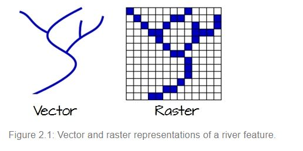

```{r setup, include=FALSE}
knitr::opts_chunk$set(echo = TRUE)
```

*******

# INTRODUCTION
## The Need for Spatial Analysis

Spatial statistics asks 'How much is where' instead of the traditional 'How much?' The key element to the analysis is the autocorrelation of the observations in space.

*Autocorrelation:* correlation between elements of data separated by a given interval of space/time (auto = correlation of a variable with itself)

*Correlation:* interdependence of variable quantities  (traditional statistics, longitudinal data, repeated measures)

### Tobler's First Law of Geography: 

Everything is related to everything else, but near things are more related than distant things (Waldo Tobler)

Observations in close spatial proximity tend to be more similar than expected for observations more spatially separated. 

### Spatial analysis: 

In spatial analysis we want to answer questions like:
1) what are the parameters for a model generating the data?
2) is the mean different in different spatial regions?
3) can we estimate a variable at an unobserved location? 

To model a spatial variable $Z(s)$ observed at $n$ locations: $Z(s) = \{Z(s_1),Z(s_2),...,Z(s_n)\}$ at spatial location $s_i=(x_i,y_i)$: \[ Z(s) = X_s \alpha + \nu\] where $X_s$ is the matrix of covariates, $\alpha$ is the coefficient vector and $\nu \sim (0,\Sigma(\theta_s))$ the error term ($\Sigma(\cdot)$ is the covariance matrix of $Z(s)$). 

Estimation can be done in traditional manners HOWEVER $\Sigma(\cdot)$ is not block diagonal (dense) so the problem is computationally intensive and provides a unique challenge. 

## Types of Spatial Data
(Classification discussed here according to Cressie (1993))

Consider a spatial process in $d$ dimensions: $\{Z(s): e \in D \subset \mathbb{R}^d\}$. $Z$ is the *attribute* we observe at spatial location $s$ (a vector if $d$ co-ordinates). Most often $d=2$ - Cartesian co-ordiantes.

### 1. Geostatistical Data

- $D$: continuous, fixed set 
- *continuous*: $Z$ can be observed everywhere
- *fixed*: points in $D$ are not stochastic 
- $Z$ can be discrete of continuous 

Data measured only at certain locations - cannot be sampled exhaustively. Can we construct a surface of $Z$ over the entire domain? 

```{r, out.width='65%', fig.align='center', echo = FALSE}
#This is how to display a graphic using Latex in R Markdown: 
knitr::include_graphics('Fig1.3.JPG')

```

```{r, out.width='55%', fig.align='center', echo = FALSE}
#This is how to display a graphic using Latex in R Markdown: 
knitr::include_graphics('Fig1.4.JPG')
```
The R package *spatstat* has built in data sets, see
https://cran.r-project.org/web/packages/spatstat/vignettes/datasets.pdf

```{r}
library(spatstat)

a <- as.ppp(longleaf)
ak <- Kest(a,correction = "none")
plot(ak)
a1 <- as.data.frame(longleaf)
#a1
#? as.ppp
#? as.psp
#? as.im
a
?longleaf

plot(a)

aa <- as.ppp(chorley)
aa
plot(aa)
?chorley
#aa$window$bdry
rpois(100,2)
```

### 2. Lattice Data (or Regional Data)

- $D$: fixed and discrete
- *fixed*: points $D$ are not stochastic
- *discrete*: countable

For example (1) data collected at the ward level, (2) remotely sensed data reported at the pixel level. This is *spatially aggregated data* thus also called Regional Data. The data is usually exhaustively observed. 

```{r, out.width='55%', fig.align='center', echo = FALSE}
#This is how to display a graphic using Latex in R Markdown: 
knitr::include_graphics('Fig1.5.JPG')
```


The term used is *sites* instead of *points* to refer to the spatial location of lattice data. Usually a polygon (ward boundary) with some representative location as the centroid (for example). 

Notation: $Z(A_i)$

1) $A_i$'s in close proximity may have similar values (positive spatial autocorrelation)
2) Identify region clustering of 'high' values
3) Where are the spatial risks? (Correlate with another covariate.)

#### Measures on Lattices

Need a measure of spatial connectivity.How is distace between 'representative points' determined? For each pair $s_i$ and $s_j$ associate a weight $w_{ij}$ for sites considered spatially connected \[w_{ij} = \left\{\begin{eqnarray}
1 & \textrm{ if connected} \\
0 & \textrm{ otherwise.}
\end{eqnarray}\right.\]

For pixels: 4-connectivity, diagonal neighbours, 8-connectivity

For polygons: if points share a common border or if representative points are less than a certain critical distance apart

```{r, out.width='55%', fig.align='center', echo = TRUE}

```

### 3. Point Patterns (Unmarked patterns)

A point pattern is a collection of points $I(s), s \in D^*$. The *random* domain $D^*$ is obtained as the locations in fixed $D$ for which $I(s) =1$ (locations where $I(s)=0)$ removed from $D$). Each realisation of the point process produces a $D^*$. The indicator function could be something like the following, but the focus is on $D^*$ more than on $I(\cdot)$: \[I(s) = \left\{
\begin{eqnarray}
1 & \textrm{ if } Z(s) \ge c \\
0 & \textrm{ otherwise.}
\end{eqnarray}
\right.\] 

Point patterns are effectively unmarked spatial data. 

We ask: *Are the points random or is there a spatial pattern?*

```{r}
library(spatstat)
murchison
mpp <- as.ppp(murchison$gold)
mpp
plot(mpp)
lpp <- as.psp(murchison$faults)
lpp
plot(lpp)
ppp <- as.polygonal(murchison$greenstone)
ppp
plot(ppp)
```

*****************

# Autocorrelation

*spatial autocorrelation*: correlation between $Z(s_i)$ and $Z(s_j)$ (the same attribute)

*positive spatial autocorrelation*: closer = similar attribute values; create a visual clustering in 3D - $(x,y,Z(s = (x,y)))$. 

What is the degree to which data are autocorrelated? 

## Moran's I:

For continuous attribute  $Z$ with $E[Z(s)] = \mu$ as well as constant variance:

\[I = \frac{n}{(n-1)s^2 w_{..}} \sum_{i=1}^n \sum_{j=1}^n w_{ij} (Z(s_i) - \bar{Z})(Z(s_j)-\bar{Z}), \textrm{ where } w_{..} = \sum_i \sum_j w_{ij}\]

- If $I > \frac{-1}{n-1}$: a location tends to be connected to locations with similar attribute values.

- If $I < \frac{-1}{n-1}$: attribute values at locations connected to a particular location tend to be dissimilar 

- Local Moran (Anselin 1995): \[I_i = n (Z_i - \bar{Z}) \frac{\sum_j w_{ij} (Z_j - \bar{Z})}{\sum_i (Z_i - \bar{Z})^2}\]

```{r}
library(raster)
#? Moran
r <- raster(nrows=10, ncols=10)
r[] <- 1:ncell(r)
image(r)
Moran(r)
m <- MoranLocal(r)
plot(m)
com <- -1/(99)
com
# Rook's case
f <- matrix(c(0,1,0,1,0,1,0,1,0), nrow=3)
Moran(r, f)
```

## Geary's C:

For continuous attribute  $Z$ with $E[Z(s)] = \mu$ as well as constant variance we have a type of autocorrelation measure:

\[C = \frac{1}{2S^2 w_{..}} \sum_{i=1}^n 
\sum_{j=1}^n w_{ij} \left(Z(s_i)-Z(s_j) \right)^2\]

If $C>1$ the locations are connected to locations with dissimilar values and vice versa for $C<1$. 

The constant mean and variance is important: if this is not true the similarity/dissimilarity is more likely due to the heterogeneous mean and variance. 

```{r}
#? Geary
r <- raster(nrows=10, ncols=10)
r[] <- 1:ncell(r)
image(r)
Geary(r)
plot(GearyLocal(r))
# Rook's case
f <- matrix(c(0,1,0,1,0,1,0,1,0), nrow=3)
Geary(r, f)
```
## The Variogram/Semi-variogram (Matheron, 1963):

$\gamma(h)$ is half the average squared difference between points $s_1$ and $s_2$ separated by distance $h$. 

\[2\gamma(h)=2\gamma(s_1,s_2) = E[(Z(s_1)-Z(s_2))^2]\]

Empirically calculated as: 

\[\hat{\gamma}(h) = \frac{1}{2|N(h \pm \delta)|} \sum_{i,j \in N(h \pm \delta) }|Z(s_1)-Z(s_2)|^2\] where $N(h \pm \delta) = \{(s_i,s_j): |s_i,s_j| \in h \pm \delta, i,j = 1,2,..., N\}$.

YouTube Video: *https://www.youtube.com/watch?v=SJLDlasDLEU&t=18s*


- At least 30 pairs of locations should be available at each $h$, thus group into $h \pm \epsilon$. 

```{r}
library(sp)
library(gstat)
#? variogram
#? meuse
data(meuse)
#meuse$x
#meuse$y
plot(x = meuse$x, y = meuse$y)
# no trend:
coordinates(meuse) = ~x+y
vv1 <- variogram(log(zinc)~1, meuse)
plot(vv1)

# residual variogram w.r.t. a linear trend:
vv2 <- variogram(log(zinc)~x+y, meuse)
plot(vv2)

# directional variogram:
vv3 <- variogram(log(zinc)~x+y, meuse, alpha=c(0,45,90,135))
plot(vv3)
vv4 <- variogram(log(zinc)~1, meuse, width=90, cutoff=1300)
plot(vv4)

```

The semivariogram captures the second-moment structure of the data. 

\[\gamma(s,h) = \frac{1}{2} [var(Z(s) - Z(s+h))] = \frac{1}{2} [var(Z(s)) + var(Z(s+h)) - 2cov(Z(s),Z(s+h))].\]

If second-order stationarity holds: $\gamma(h) = \frac{1}{2} (2\sigma^2 -2 C(h)) = C(0) - C(h)$.

If positive spatial correlation is present: 

- $\gamma(0) = C(0) - C(0) = 0$. However due to measurement error and microscale variation there may be a *nugget effect* - this is often observed in sample variograms. 
- The variogram attains $\gamma(h^*) = \sigma^2$ when the lag exceeds the distance $h^*$ for which the data points are correlated. 
- The range is $h^*$ (where $C(h^*) = 0$ or at $95\% \sigma^2$)

Empirical semivariogram:

\[\hat{\gamma}(h) = \frac{1}{2 |N(h)|} \sum_{N(h)} \left(Z(s_i) - Z(s_j) \right)^2 \]

Empirical covariance estimation: 

\[\hat{C}(h) = \frac{1}{|N(h)|} \sum_{N(h)} (Z(s_i)-\bar{Z})(Z(s_j)-\bar{Z]})\]

```{r, out.width='55%', fig.align='center', echo = TRUE}
knitr::include_graphics('variogram.jpg')
``` 

# Autocorrelation Functions

## Autocorrelation function for a time series 

For a time series $Z(t_1),...,Z(t_n)$ with $E[Z(t_i)] = 0$ and $var(Z(t_i)) = \sigma^2, i = 1,...,n$ the covariance function  is a function of the distance in time $t_j - t_i$ \[cov(Z(t_i),Z(t_j)) = E[Z(t_i)Z(t_j)] = C(t_j-t_i).\] 

The autocorrelation function is \[R(t_j-t_i) = \frac{cov(Z(t_i),Z(t_j))}{\sqrt{var(Z(t_i))var(Z(t_j))}} = \frac{C(t_j- t_i)}{C(0)}.\]

But time has direction, space does not... 

## Autocorrelation function in space

*Covariance function*: $C(s,h) = cov(Z(s),Z(s+h)) = E[(Z(s) - \mu(s))(Z(s+h) - \mu(s+h))]$

*Autocorrelation function (correlogram)*: \[R(s,h) = \frac{C(s,h)}{\sqrt{var(Z(s)) var(Z(s+h))}}\]

Edge effects are more important than in time series since potentially many points located at the domain boundary. 

Spatial dependencies may develop differently in various directions - anisotropy. 

*Second-order stationarity*: $Z(s)$ has a constant mean $\mu$ and a covariance function which is a function of the spatial separation between points only i.e. $C(h)$. ($C(0) = cov(Z(s), Z(s)+0) = var(Z(s)) = \sigma^2$ so not a function of spatial location.)

So under second-order stationarity: $cov(Z(s),Z(s+h)) = C(h)$ abd $R(h) = \frac{C(h)}{\sigma^2}.$

```{r}
plot(murchison$gold)
den <- density(murchison$gold)
plot(den)
den2 <- density(murchison$faults)
plot(den2)


#? bw.diggle
#? bw.scott
#? bw.stoyan
#? bw.frac

den <- density(murchison$gold, bw.diggle)
plot(den)
den <- density(murchison$gold, bw.scott)
plot(den)
den <- density(murchison$gold, bw.stoyan)
plot(den)
den <- density(murchison$gold, bw.frac)
plot(den)
```

## Semivariogram and Covariogram 

*Semivariogram:* $\gamma(h)$ vs. $h$ 

*Variogram:* $2\gamma(h)$ (but naming is not consistant)

*Covariance function:* $C(h)$ vs. $h$

Under stationarity $\gamma(h) = \gamma(s_i-s_j) = C(0) - C(s_i-s_j)$. Recall that $C(0) = var(Z(s))$. 

ESTIMATION (Matheron 1962, 1963): \[\gamma(s_i-s_j) = \frac{1}{2|N(s_i-s_j)|} \sum_{N(s_i-s_j)} ({Z(s_i) - Z(s_j)})^2\]

\[C(s_i-s_j) = \frac{1}{2|N(s_i-s_j)|} \sum_{N(s_i-s_j)} (Z(s_i) - \bar{Z})(Z(s_j)-\bar{Z}) \textrm{ where } \bar{Z} = \frac{1}{n} \sum_{i=1}^n Z(s_i). \]

# GIS and Spatial Statistics

See online course: *https://mgimond.github.io/Spatial/index.html*

A Geographic Information System (GIS) is a multi-component environment used to create, manage, visualize and analyze data and its spatial counterpart. 

 In the context of mainstream GIS software, the term analysis refers to data manipulation and data querying. 
 
 In the context of spatial analysis, the analysis focuses on the statistical analysis of patterns and underlying processes or more generally, spatial analysis addresses the question "what could have been the genesis of the observed spatial pattern?" It's an exploratory process whereby we attempt to quantify the observed pattern then explore the processes that may have generated the pattern.

```{r, out.width='65%', fig.align='center', echo = FALSE}
#This is how to display a graphic using Latex in R Markdown: 


```

Many GIS software applications are available-both commercial and open source. Two popular applications are ArcGIS and QGIS.

A shapefile is a file-based data format native to ArcView 3.x software (a much older version of ArcMap). Conceptually, a shapefile is a feature class-it stores a collection of features that have the same geometry type (point, line, or polygon), the same attributes, and a common spatial extent. Despite what its name may imply, a "single" shapefile is actually composed of at least three files, and as many as eight. Each file that makes up a "shapefile" has a common filename but different extension type. *.shp*

```{r}

```
